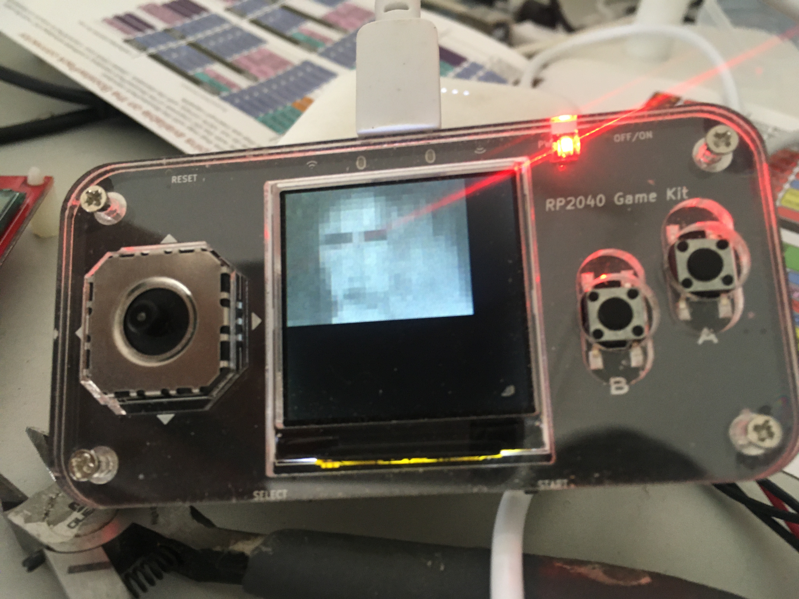

# Thermal camera

Base on MLX90640 sensor and rp2040 microprocessor.

The MLX90640 sensor driver is base on the
[Adafruit_CircuitPython_MLX90640](https://github.com/adafruit/Adafruit_CircuitPython_MLX90640),
and ports to micropython platform.

The screen is 240*240 LCD uses st7789 driver base on [st7789_mpy](https://github.com/russhughes/st7789_mpy)

## Example

## Todo

[ ] Heat map
[ ] Auxiliary information display
